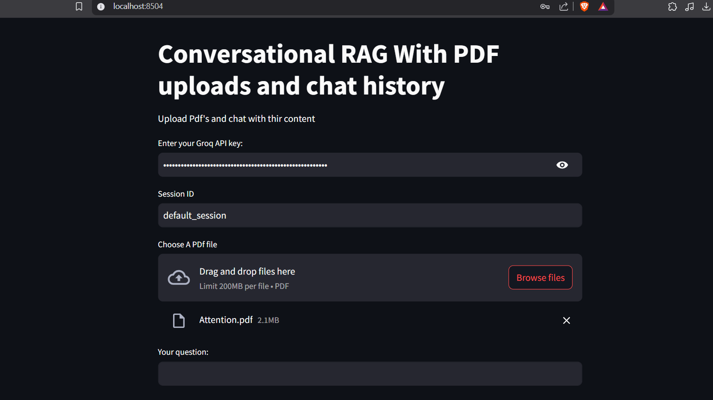

# 📚 Conversational RAG with PDF Uploads and Chat History


## 🚀 Overview
This project implements a **Conversational Retrieval-Augmented Generation (RAG) system** that allows users to:
- 📄 **Upload PDFs** and extract information
- 💬 **Chat with the AI assistant** to retrieve answers from uploaded documents
- 🗂 **Maintain chat history** for context-aware conversations

## ✨ Features
- ✅ **PDF Upload Support**: Extracts text from uploaded PDFs
- 🤖 **Conversational RAG**: Retrieves relevant document context for accurate responses
- 🗨 **Chat History Retention**: Ensures coherent and contextual responses
- 🔎 **Semantic Search**: Retrieves relevant text from PDFs using embeddings
- 🎨 **User-Friendly Interface**: Built with Streamlit for an interactive chat experience

## 🛠 Tech Stack
- **Backend**:
  - 🐍 Python
  - ⚡ FastAPI / Flask
  - 🧠 LangChain (for RAG)
  - 📦 ChromaDB / FAISS (for vector storage)
  - 🏋️ Hugging Face Embeddings
  - 📄 PyMuPDF / PDFPlumber (for PDF parsing)
- **Frontend**:
  - 🎨 Streamlit (for UI)
- **LLMs**:
  - 🤗 OpenAI GPT / Groq Gemma2-9b-It

## ⚙️ Installation
### Prerequisites
- 🐍 Python 3.8+
- 📦 Virtual environment (optional but recommended)

### Steps
1. **Clone the repository**
   ```sh
   git clone https://github.com/your-repo/conversational-rag.git
   cd conversational-rag
   ```

2. **Create and activate a virtual environment**
   ```sh
   python -m venv venv
   source venv/bin/activate  # On Windows, use `venv\Scripts\activate`
   ```

3. **Install dependencies**
   ```sh
   pip install -r requirements.txt
   ```

4. **Run the Streamlit app**
   ```sh
   streamlit run app.py
   ```

## 🎯 Usage
1. **Enter your Groq API Key** in the provided input field.
2. **Upload PDF files** to the interface.
3. **Ask questions** about the document content.
4. **View chat history** for contextual conversations.


